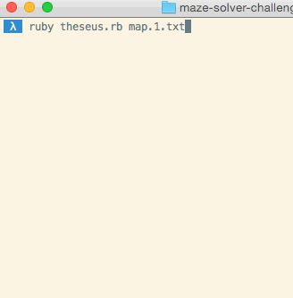

# Labyrinth

> Thus, the hero met the Minotaur in the dark depths of the Labyrinth and was not frightened." -Theseus and the Minotaur

In this challenge, you will need to create a program that determines whether the labyrinth is solvable or not. Step by step you will create a program to:

   * Read the file containing the Labyrinth
   * Represent the Labyrinth in code
   * Use strategy to determine if the Labyrinth is resolvable

**Tests required**. This exercise can be quite overwhelming if you don't thoroughly test even the most basic methods. For example, a simple mistake like mixing x and y can have some confusing and non-obvious consequences. If you don't know how to test something, get help.
To install project dependencies - `` npm install``
To run tests - `` npm test``

## Reading the labyrinth

Your labyrinth will be defined in a text file that looks like this:

```
o#........
.#####.##.
.......##.
######.#*.
.......###
```
 * `#` means wall
 * `.` means open space
 * `o` means starting place
 * `*` means your ultimate goal


You are provided with a method called `readMaze`. It takes a file and returns a two-dimensional array representing the labyrinth. See the example in the spec file.

## Release 1. Simplified tasks

Your task is to write a **recursive** algorithm that determines whether you can pass the labyrinth. Your `isSolvable ()` method should return `true` if the finish (`*`) is reached from the beginning (`o`). It should return `false` if the end cannot be reached (no path). You don't need to return the path.

Before you start, work with your partner to think about what questions you need to answer. Here are some possible questions:

 * Where is the starting position?
 * Is a specific position (x, y) open? Is it a wall? Is this the goal?
 * If I look at a certain position, what surrounds it?
 * How can I know which cells around a certain position are open space?

For each method you write, write a test.

We will use the methods we write in this release in the next task.

## Release 2. Exploring the labyrinth

Now that we have written the methods, we can use them to write our recursive algorithm.

As a reminder, here's our task:

> The task is to write a recursive algorithm that determines whether the maze can be traversed or not. Your method is `isSolvable`, It should return` true` if the finish (`*`) is reachable from the starting position (`o`). It should return `false` if the end cannot be reached (no path). You don't need to return the path.

Hint: your recursive algorithm will have to explore the cells until it finds a finish, or determines that the finish is unattainable.
Make sure you are testing different types of labyrinths (problems). Some examples are contained in this repository.

## Stretch 1. Iterative approach

Come up with an iterative solution and compare it to the recursive solution.




Can you create iterative solutiomns that mimic two approaches?
## Stretch 2 More challenging mazes and open terrain

Start your program with more challenging labyrinths as input.
```
...#.....#
...#.#.#.#
...#.#.#.#
.#...#.#*#
.#########
........o.
####.#####
..........
.###.####.
...#......
```


```
.................
........#........
........#.*......
........#........
........#........
........#........
........#........
........#........
........#........
.o......#........
........#........
.................
```
